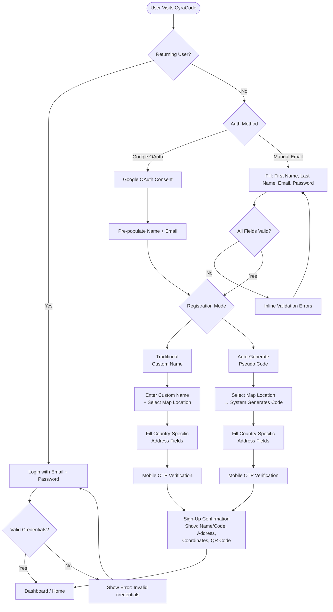
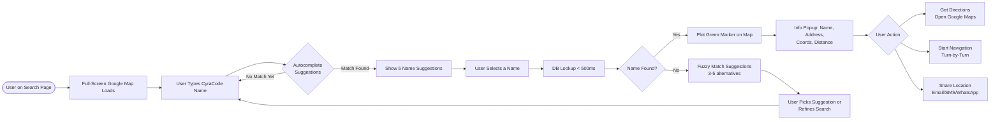
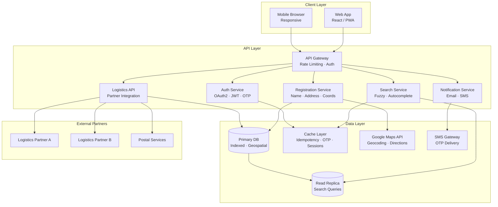
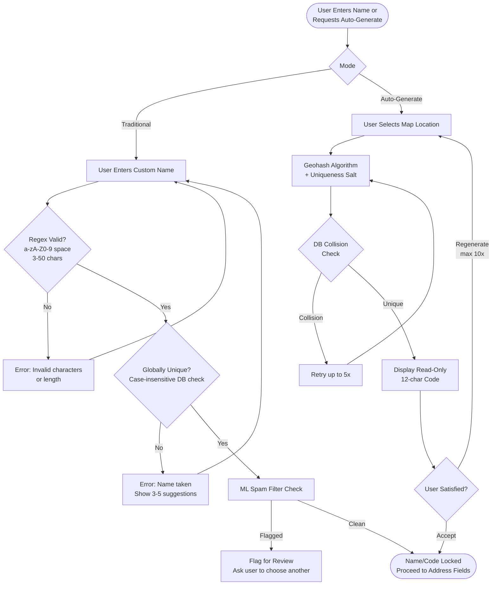
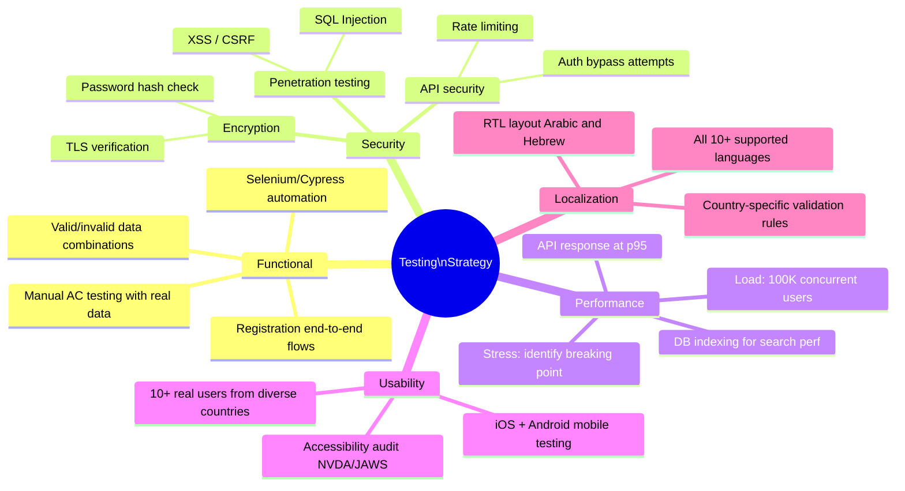

# CyraCode — Universal Address Naming System
## Product Specification & Acceptance Criteria

**Version:** 1.0  
**Date:** June 2024  

---

## Table of Contents

1. [Executive Summary](#1-executive-summary)
2. [System Flow Overview](#2-system-flow-overview)
3. [Screen 1 — Landing Page](#3-screen-1--landing-page)
4. [Screen 2 — Sign Up (Traditional / Custom Name)](#4-screen-2--sign-up-traditional--custom-name)
5. [Screen 3 — Sign Up (Auto-Generate / Pseudo Name)](#5-screen-3--sign-up-auto-generate--pseudo-name)
6. [Screen 4 — Sign Up Confirmation](#6-screen-4--sign-up-confirmation)
7. [Screen 5 — Search & Navigation](#7-screen-5--search--navigation)
8. [Cross-Cutting Acceptance Criteria](#8-cross-cutting-acceptance-criteria)
9. [Design Recommendations](#9-design-recommendations)
10. [Testing Strategy](#10-testing-strategy)
11. [Success Metrics & KPIs](#11-success-metrics--kpis)
12. [Glossary](#12-glossary)
13. [Appendix — Country-Specific Address Formats](#13-appendix--country-specific-address-formats)

---

## 1. Executive Summary

CyraCode is a **global address registration platform** that maps a unique, human-readable name to a single postal address with precise geolocation coordinates. It serves as a universal delivery identifier for logistics companies, postal services, and drone delivery systems.

### Platform Pillars

| Pillar | Detail |
|---|---|
| Scale | Supports 1M+ registered users with geolocation mapping |
| Registration Modes | **Traditional** (custom human-readable name) and **Auto-Generate** (system-issued pseudo code) |
| Name Immutability | Registered names are globally unique and cannot be changed (exception: mobile owner transfer) |
| Integrations | APIs for major logistics and postal companies; Google Maps integration |
| Compliance | GDPR, WCAG 2.1 AA, TLS 1.2+, HTTPS/HSTS |

---

## 2. System Flow Overview

### 2.1 Complete User Journey



### 2.2 OTP Verification Flow

```mermaid
sequenceDiagram
    actor User
    participant UI as Web App
    participant API as CyraCode API
    participant SMS as SMS Gateway
    participant DB as Database

    User->>UI: Enter mobile number (E.164)
    UI->>API: POST /otp/send { mobile }
    API->>DB: Hash OTP + store with 5-min TTL
    API->>SMS: Dispatch 6-digit OTP
    SMS-->>User: SMS with OTP

    User->>UI: Enter OTP
    UI->>API: POST /otp/verify { mobile, otp }
    API->>DB: Compare hash; check expiry

    alt OTP Valid & Not Expired
        DB-->>API: Match
        API-->>UI: 200 Verified
        UI-->>User: Proceed to next step
    else OTP Expired
        DB-->>API: TTL exceeded
        API-->>UI: 410 Expired
        UI-->>User: "OTP expired. Request new OTP."
    else Invalid OTP (< 5 attempts)
        DB-->>API: Mismatch
        API-->>UI: 401 + remaining attempts
        UI-->>User: "Invalid OTP. X attempts remaining."
    else 5 Failed Attempts
        DB-->>API: Max attempts reached
        API-->>UI: 429 Locked
        UI-->>User: "Account locked for 15 minutes."
    end
```

### 2.3 Search & Navigation Flow



### 2.4 System Architecture



### 2.5 Name Registration Decision Tree



---

## 3. Screen 1 — Landing Page

The landing page is the primary entry point for new and returning users, handling authentication and initial registration.

### Acceptance Criteria

| AC | Scenario | Given | When | Then | Notes |
|---|---|---|---|---|---|
| **AC 1.1** | Login with Existing Credentials | User has a registered account | Enters valid email + password | Authenticated; redirected to dashboard | Session token generated; audit log recorded |
| **AC 1.2** | Google OAuth Sign-In | User clicks "Sign up with Google" | Google OAuth consent screen shown | Profile data (name, email) pre-populated; redirected to next screen | OAuth flow initiated seamlessly |
| **AC 1.3** | Manual Email Registration Entry | User fills registration form | Enters first name, last name, email, password | All fields validated; "Next" button enabled | Password: min 8 chars, 1 uppercase, 1 number, 1 special char |
| **AC 1.4** | Invalid Email Format Rejection | User enters malformed email | Types `notanemail` or `test@` | Error: "Please enter a valid email address" | Real-time regex; error clears on valid input |
| **AC 1.5** | Existing Email Detection | Email already in system | User enters that email | Error: "This email is already registered. Please login or use a different email." | Case-insensitive DB lookup |
| **AC 1.6** | Empty Field Submission | Required fields are empty | User clicks "Next" | Fields highlighted red; "This field is required" | Focus moved to first empty field |
| **AC 1.7** | Password Visibility Toggle | Password field has eye icon | User clicks eye icon | Password toggles visible/hidden | No security log entry for this action |
| **AC 1.8** | Remember Me Functionality | User checks "Remember Me" and logs in | User returns to site | Email pre-populated | Session cookie persisted 30 days; device-specific |
| **AC 1.9** | Forgot Password Link | User on login section | Clicks "Forgot Password" | Redirected to password reset page | Reset link valid for 24 hours; OTP or token-based |
| **AC 1.10** | Page Load Performance | Typical network conditions | User opens landing page | Fully loaded ≤ 2s; interactive ≤ 3.5s | Supports 1M concurrent users |

### Edge Cases

- **Extreme Load (100K concurrent users):** Page load ≤ 3 seconds
- **Slow Network (3G):** Page load ≤ 5 seconds
- **Mobile (< 480px):** Form fully usable
- **International Characters:** Email validation supports Internationalized Domain Names (IDN)
- **Rate Limiting:** Max 10 auth requests/minute per IP (brute-force prevention)

---

## 4. Screen 2 — Sign Up (Traditional / Custom Name)

Users manually choose a unique name and provide full address details. This is a multi-part form.

### Part A — Geolocation & Custom Name

| AC | Scenario | Given | When | Then | Notes |
|---|---|---|---|---|---|
| **AC 2.1** | Google Map Display & Marker Placement | User views map | Map loads | Current or selected address shown with red pin | Supports zoom/pan; marker updates on address change |
| **AC 2.2** | Custom Name Entry & Uniqueness Check | User types a name | Real-time lookup | Green checkmark if available | DB response < 500ms; supports 1M+ name checks/day |
| **AC 2.3** | Name Already Taken | Name is registered by another user | User submits | Error: "This name is already taken. Try: [suggestions]" | 3–5 alternatives suggested; case-insensitive |
| **AC 2.4** | Name Validation Rules | User types invalid characters | Submits form | Error: "Name must contain only letters, numbers, and spaces. Max 50 characters." | Regex: `^[a-zA-Z0-9 ]{3,50}$` |
| **AC 2.5** | Auto-Fetch Coordinates from Map | User selects map location | Location selected | Longitude + Latitude auto-populated | Read-only fields; 6+ decimal precision |
| **AC 2.6** | Coordinate Immutability | Lat/Lng fields visible | User tries to edit | Fields disabled; edits rejected | Client + server-side enforcement |
| **AC 2.7** | Generate Code Button Disabled | No map location selected | User clicks "Generate Code" | Button stays disabled; tooltip: "Please select a location on the map first" | Visual feedback for disabled state |

### Part B — Address Details (Country-Specific)

| AC | Scenario | Given | When | Then | Notes |
|---|---|---|---|---|---|
| **AC 2.8** | Country Dropdown Selection | 195+ countries available | User selects country | Address fields update to country-specific format | ISO 3166-1 compliant |
| **AC 2.9** | India Address Fields | Country = India | Form renders | State, District, City, Postal Code (PIN), Flat/Plot, Building Name, Street Name, Landmark | Cascading State → District dropdowns; all required |
| **AC 2.10** | USA Address Fields | Country = USA | Form renders | State, City, Street Address, ZIP Code, Apt/Suite | USPS state lookup; ZIP: 5-digit or 5+4 |
| **AC 2.11** | UK Address Fields | Country = UK | Form renders | Postcode, City, Street Address, Building Number/Name, Floor/Unit | Royal Mail API validation; case-insensitive |
| **AC 2.12** | State/Province Dropdown | Country selected | User clicks State | Valid states/provinces for that country shown | Sourced from authoritative postal DB |
| **AC 2.13** | Postal Code Validation | Country selected | User enters postal code | Format validated per country standard | Regex per country; real-time feedback |
| **AC 2.14** | Landmark Field (Optional) | Address form | User enters landmark | Accepted (max 100 chars) | Stored for courier reference |
| **AC 2.15** | Flat/Plot/Villa Number Parsing | Address form | User enters `A-302, Tower 5, Plot 45` | Stored as-is; supports special characters | Supports multi-part complex numbers |
| **AC 2.16** | Address Field Mandatory Validation | Required field empty | User submits | Red highlight + "This field is required" | Client + server-side validation |
| **AC 2.17** | Longitude/Latitude Consistency | Address and map location conflict | User submits | Warning: "Address and map location do not match. Please verify." | Triggered if geo-distance > 1 km |

### Part C — Mobile Verification & OTP

| AC | Scenario | Given | When | Then | Notes |
|---|---|---|---|---|---|
| **AC 2.18** | Mobile Number Input | Mobile field shown | User enters number | Accepted in E.164 format | Regex: `^\+?[1-9]\d{1,14}$`; country code validated |
| **AC 2.19** | OTP Generation & Delivery | User clicks "Send OTP" | System generates OTP | 6-digit OTP sent via SMS within 10 seconds | Valid 5 minutes; stored as hash |
| **AC 2.20** | OTP Expiry | OTP is > 5 minutes old | User enters expired OTP | Error: "OTP has expired. Please request a new OTP." | Expired OTP cannot be reused |
| **AC 2.21** | Invalid OTP Rejection | User enters wrong OTP | 3 failed attempts | "Invalid OTP. You have 2 attempts remaining." | Locked after 5 failures; 15-minute lockout |
| **AC 2.22** | Resend OTP Cooldown | User clicks "Resend OTP" | Within 30 seconds of last send | Message: "Please wait before requesting a new OTP" | 30-second cooldown enforced |
| **AC 2.23** | OTP Verification Success | User enters correct OTP | Verified | Mobile flagged verified in DB; proceed to next step | Session updated |

### Edge Cases

- **Duplicate Address Detection:** Two users cannot register within a 10m radius (same lat/lng + country)
- **Ocean/Uninhabited Land:** Coordinates on ocean rejected — "Please select a valid residential address"
- **Spam Name Detection:** ML filter flags inappropriate names for review
- **International Characters:** Name field accepts Unicode (Hindi, Arabic, Chinese, Cyrillic)
- **Timezone Handling:** All timestamps stored in UTC; OTP validity shown in user's local timezone

---

## 5. Screen 3 — Sign Up (Auto-Generate / Pseudo Name)

Users register without choosing a name. The system generates a unique 12-character alphanumeric pseudo code (e.g., `ABX2l2X8LICN`). Address and mobile verification flows are identical to Screen 2.

### Acceptance Criteria

| AC | Scenario | Given | When | Then | Notes |
|---|---|---|---|---|---|
| **AC 3.1** | Auto-Generate Code on Location Selection | User selects map location | No custom name entered | System generates unique 12-char code | Geohash-based algorithm + uniqueness salt; < 100ms |
| **AC 3.2** | Generated Code Display & Copy | Code generated | Shown in read-only field | User can copy with one click; tooltip "Copied!" | Code stored in session + DB |
| **AC 3.3** | Code Immutability | Code displayed | User tries to edit field | Field disabled; server rejects edit attempts | Client + server enforcement |
| **AC 3.4** | Generate New Code | User wants a different code | Clicks "Generate New Code" | New unique code generated; old discarded | Max 10 regenerations per session |
| **AC 3.5** | Code Format Consistency | System generates codes | Any generated code | 12-char format: 3 uppercase + 2 uppercase + 7 lowercase/numbers | Regex: `^[A-Z]{3}[A-Z]{2}[a-z0-9]{7}$` |
| **AC 3.6** | Address Details | Address form | User fills fields | Same validations as AC 2.8–2.17 apply | Country-specific fields, postal codes, mandatory fields |
| **AC 3.7** | Mobile Verification | Mobile step | User verifies mobile | Same OTP flow as AC 2.18–2.23 | No difference between Traditional and Auto-Generate |
| **AC 3.8** | Uniqueness Guarantee | Code generated | DB collision check | Always globally unique | Hash-based: probability of collision < 1 in 10 billion |

### Edge Cases

- **High Load Code Generation:** Uniqueness validated < 100ms at 100K concurrent users
- **DB Collision Retry:** System retries generation up to 5 times if collision detected
- **Regeneration Limit:** Max 10 code regenerations per registration session

---

## 6. Screen 4 — Sign Up Confirmation

Final screen shown after successful registration. Displays a success summary with all registered details, a QR code, and next-step options.

### Acceptance Criteria

| AC | Scenario | Given | When | Then | Notes |
|---|---|---|---|---|---|
| **AC 4.1** | Congratulations Message | Registration complete | Confirmation page loads | "Congratulations! Welcome to CyraCode" displayed with smiley icon | Uplifting UX tone |
| **AC 4.2** | Registered Name/Code Display | Confirmation page | Page renders | Custom name or auto-generated code shown prominently | Large, centered font |
| **AC 4.3** | Address Summary Display | Confirmation page | Page renders | All address fields shown in read-only format | Formatted per country standard; editable post-activation |
| **AC 4.4** | Coordinates Display | Confirmation page | Page renders | "Coordinates: 3.1145737, 80.2215774" displayed | Read-only; click links to map view |
| **AC 4.5** | QR Code Generation | Registration stored | System generates QR | QR code encodes CyraCode name + coordinates; shown for download/share | Format: PNG/SVG, 300×300px; scannable with standard readers |
| **AC 4.6** | QR Code Functionality | User has phone | Scans QR code | Opens Google Maps to registered location or launches CyraCode app | Deep link; falls back to web if app not installed |
| **AC 4.7** | Download QR Code | "Download QR Code" button | User clicks | PNG downloaded | Filename: `CyraCode_[CustomName]_[Timestamp].png` |
| **AC 4.8** | Share CyraCode Name | "Share" button | User clicks | Options: Email, SMS, WhatsApp, Facebook, Copy Link | Pre-filled: "Find me at my CyraCode: [Name]. Use this for deliveries worldwide!" |
| **AC 4.9** | Next Steps Guidance | Confirmation page | Page renders | Options: Complete Profile, Set Delivery Preferences, Share with Courier Partners | Skip available; all accessible from dashboard later |
| **AC 4.10** | Confirmation Email | Registration complete | System triggers | Email sent with: name, coordinates, QR attachment, activation link | Delivered within 5 minutes; opt-in for notifications |

### Edge Cases

- **QR Generation Failure:** Show error with retry button
- **Email Delivery Delay:** Display "Confirmation email may take 5–10 minutes to arrive"
- **Browser Back Button:** Block navigation back to registration form; redirect to dashboard

---

## 7. Screen 5 — Search & Navigation

The search page is the primary public-facing view — a full-screen interactive map where anyone can look up registered CyraCode names and get directions.

### Acceptance Criteria

| AC | Scenario | Given | When | Then | Notes |
|---|---|---|---|---|---|
| **AC 5.1** | Map Display on Page Load | User opens search page | Page loads | Full-screen Google Map loads with user's location (if permission granted) | Loads ≤ 2s; default zoom level 15 |
| **AC 5.2** | Search CyraCode Name | Search box available | User types a name | Name resolved to coordinates; map marker placed | DB lookup < 500ms; case-insensitive; real-time autocomplete |
| **AC 5.3** | Search Results Display | Name found | Result returned | Green marker on map; info window: Name, Address, Coordinates | Green = CyraCode address; Red = standard location |
| **AC 5.4** | Search Name Not Found | Name not in DB | Search completes | "CyraCode '[Name]' not found. Did you mean: [suggestions]?" | Fuzzy match returns 3–5 alternatives |
| **AC 5.5** | Autocomplete Suggestions | User typing in search box | After first keystroke | Dropdown shows up to 5 matching CyraCode names | Shows Name, Brief Address, Distance from user |
| **AC 5.6** | Get Directions | Location found on map | User clicks "Get Directions" | Google Maps opens with route from user's location | Deep link to app; fallback to web |
| **AC 5.7** | Start Navigation | "Start Navigation" clicked | Navigation begins | Google Maps turn-by-turn navigation activated | Voice guidance enabled if supported; real-time traffic |
| **AC 5.8** | Share Location | "Share" button clicked | User selects channel | Options: Email, SMS, WhatsApp, Facebook, Copy Link | Pre-filled: "Meet me at [CyraCode Name]: [Full Address]" |
| **AC 5.9** | Location Details Popup | User clicks map marker | Popup appears | Displays: CyraCode Name, Full Address, Coordinates, Distance, "Directions" button | Clicking address opens details section |
| **AC 5.10** | Search History | User has prior searches | User opens search box | Recent searches shown in dropdown | Stored in localStorage; max 10 entries; clear option available |

### Edge Cases

- **Offline Mode:** Display cached search results from last session
- **Geolocation Permission Denied:** Show default world map; allow manual start location entry
- **International Searches:** Distance shown in local units (km or miles)
- **Mobile Optimization:** Touch-friendly buttons; fully functional on iOS/Android
- **Scale Performance:** Search responds < 200ms at 1M+ registered CyraCodes

---

## 8. Cross-Cutting Acceptance Criteria

### 8.1 Security & Privacy

| AC | Requirement | Condition | Expected | Implementation |
|---|---|---|---|---|
| **AC 6.1** | HTTPS/TLS Encryption | All data in transit | TLS 1.2+ enforced; HSTS header present | No mixed content warnings |
| **AC 6.2** | Password Hashing | Passwords stored | bcrypt with min cost factor 12 | Plaintext never logged; salted hash only |
| **AC 6.3** | OTP Security | OTP in transit | 6-digit; 5-min TTL; stored as hash | Never logged in plaintext; single-use |
| **AC 6.4** | API Rate Limiting | Auth endpoints | 10 req/min per IP; general API: 100 req/min | 429 status on exceed; client-side backoff |
| **AC 6.5** | GDPR Compliance | User data | Consent obtained; right to access/delete | Privacy policy on landing page; data deletion in settings |
| **AC 6.6** | Input Sanitization | All user inputs | XSS and SQL injection prevented | Server-side validation; parameterized queries; no `eval()` |

### 8.2 Performance & Scalability

| AC | Requirement | Condition | Expected | Implementation |
|---|---|---|---|---|
| **AC 6.7** | Page Load Time | Normal network | Fully loaded ≤ 2s; interactive ≤ 3.5s | Lighthouse measured; supports 1M concurrent users |
| **AC 6.8** | Database Query Performance | Name search | < 200ms response for 1M records | Indexed fields; read replicas for search |
| **AC 6.9** | API Response Time | General API | < 500ms at p95 | CDN caching; query optimization |
| **AC 6.10** | Image/Media Optimization | QR codes & images | WebP format; < 100KB per image | Lazy loading for below-fold content |
| **AC 6.11** | DB Backup & Recovery | System operational | Daily backups; RTO < 1 hour | Multi-region replication; quarterly DR testing |

### 8.3 Accessibility & Localization

| AC | Requirement | Condition | Expected | Implementation |
|---|---|---|---|---|
| **AC 6.12** | WCAG 2.1 AA Compliance | All UI | Keyboard nav; screen reader; color contrast | Tested with NVDA/JAWS; axe audit passes |
| **AC 6.13** | Multi-Language Support | UI for global users | 10+ languages: EN, ES, FR, DE, ZH, JA, AR, HI, PT, RU | Language dropdown; persisted in preferences |
| **AC 6.14** | RTL Language Support | Arabic or Hebrew selected | UI layout and text alignment reverses | RTL CSS applied; tested with Arabic and Hebrew |
| **AC 6.15** | Date & Time Localization | Dates displayed | Formatted per locale; timezone correct | OTP expiry in user's local timezone |
| **AC 6.16** | Postal Code Format Localization | Country changed | Label + format changes (e.g., "ZIP Code" → "Postcode") | Per-country regex and placeholder |

### 8.4 Data Integrity & Validation

| AC | Requirement | Condition | Expected | Implementation |
|---|---|---|---|---|
| **AC 6.17** | Idempotency Keys | Double form submission | Second submission rejected | Key cached for 24 hours |
| **AC 6.18** | Coordinate Validation | Lat/Lng from Google Maps | lat ∈ [-90, 90]; lng ∈ [-180, 180] | Server-side; rejects ocean/uninhabited land |
| **AC 6.19** | Duplicate Address Prevention | Two users; same coords | Second blocked: "An address within 10 meters already registered" | Geospatial DB check; > 10m difference allowed |
| **AC 6.20** | Email Uniqueness | Duplicate email | Registration blocked; prompted to login | Case-insensitive; prevents account enumeration |
| **AC 6.21** | Mobile Number Normalization | Various input formats | Normalized to E.164: `+[country code][number]` | Country code valid; total 10–15 digits |
| **AC 6.22** | Address Field Length Limits | Extremely long input | Fields truncated per country max (e.g., Street: 100 chars) | Validation error before save |

### 8.5 Integration with Logistics Partners

| AC | Requirement | Condition | Expected | Implementation |
|---|---|---|---|---|
| **AC 6.23** | CyraCode API Availability | Partner queries API | Returns: Name, Coordinates, Full Address, Postal Code | < 200ms response; 99.99% uptime SLA |
| **AC 6.24** | Reverse Geocoding Lookup | Partner provides coordinates | Returns nearest CyraCode within 50m radius | Null if no match; partner proceeds with manual delivery |
| **AC 6.25** | Address Format Standardization | Multiple partners query | Consistent structured response format | No variation in response schema |
| **AC 6.26** | API Authentication | Partner accesses API | API key + OAuth2 bearer token required | Rate limiting per partner; full audit log |
| **AC 6.27** | Delivery Confirmation | Partner confirms delivery | User notified via app/email: name, time, proof of delivery | Real-time status update; stored in delivery history |

---

## 9. Design Recommendations

### Enhanced Form UX
- **Multi-Step Progress Indicator:** Show "Step 1 of 4", "Step 2 of 4" etc.
- **Real-Time Inline Validation:** Green checkmark on valid field; red inline error on invalid
- **Save Draft & Resume:** Allow users to save progress and continue later

### Map Interaction
- **Address Search on Map:** Type address in map search bar to auto-populate form fields
- **Click-to-Place Marker:** Alternative to address search; user clicks map to set location
- **Live Map Confirmation:** Map marker updates as user types address

### Mobile-First Design
- **Responsive Layout:** 320px–1200px viewport support
- **Touch-Friendly Buttons:** Minimum 44px height with adequate spacing
- **Native Device Features:** Camera for QR scanning; numeric keyboard for mobile number entry

### Confirmation & Sharing
- **Animated Success State:** Confetti or animated checkmark on registration complete
- **Shareable QR Card:** Branded card combining name, address, and QR code for social sharing
- **One-Click Social Share:** Pre-populated posts for WhatsApp, Facebook, etc.

### Error Handling
- **Plain Language Errors:** No technical jargon; actionable suggestions included
- **Inline Errors:** Next to fields, not in modals
- **Loading States:** Skeleton loaders or spinners during API calls

### Branding & Visual Design
- **Primary Color:** CyraCode orange for CTAs
- **Icons:** Location-themed custom icons; map-related illustrations
- **Typography:** Sans-serif; clear H1 → H2 → H3 hierarchy
- **Whitespace:** Generous spacing to reduce cognitive load

---

## 10. Testing Strategy



### Test Coverage Summary

| Area | Tool / Approach | Coverage Target |
|---|---|---|
| Functional | Cypress E2E / Selenium | 100% of ACs |
| Unit | Jest / Mocha | 80%+ code coverage |
| Security | OWASP ZAP / Burp Suite | All OWASP Top 10 |
| Performance | k6 / JMeter | 100K concurrent users |
| Accessibility | axe / NVDA / JAWS | WCAG 2.1 AA |
| Localization | Manual + automated i18n | 10+ languages |
| Mobile | BrowserStack (iOS + Android) | Key user flows |

---

## 11. Success Metrics & KPIs

### Platform Health

| Metric | Target |
|---|---|
| Uptime | 99.99% availability |
| API Response Time | < 200ms at p95 |
| DB Query (1M records) | < 500ms |
| Recovery Time Objective (RTO) | < 1 hour |

### User Adoption

| Metric | Target |
|---|---|
| Registration Completion Rate | > 80% (all 4 screens completed) |
| Mobile Registration Rate | > 60% of all registrations |
| Average Registration Time | < 10 minutes |

### Data Quality

| Metric | Target |
|---|---|
| Address Validation Success Rate | > 95% pass country-specific validation |
| Duplicate Address Rate | < 0.1% (within 10m radius) |
| OTP Verification Success Rate | > 98% |

### Logistics Integration

| Metric | Target |
|---|---|
| Daily API Requests (by Month 6) | > 1M requests/day |
| Delivery Success Rate | > 95% to registered addresses |
| Partner Onboarding (Year 1) | 50+ logistics partners |

---

## 12. Glossary

| Term | Definition |
|---|---|
| **CyraCode** | Unique identifier (custom name or pseudo code) mapped to a single postal address + geolocation |
| **Geohash** | Algorithm converting geographic coordinates into a short alphanumeric string for spatial indexing |
| **E.164 Format** | International phone number standard: `+[country code][area code][number]` |
| **OTP** | One-Time Password — 6-digit numeric code sent via SMS for mobile verification; valid 5 minutes |
| **Longitude/Latitude** | Geographic coordinates derived from Google Maps; immutable once registered |
| **Pseudo Code** | Auto-generated 12-char CyraCode (e.g., `ABX2l2X8LICN`); system-created, non-customizable |
| **RTO** | Recovery Time Objective — maximum acceptable system downtime (CyraCode target: 1 hour) |
| **Idempotency** | Property ensuring repeated identical API requests produce the same result without side effects |
| **WCAG 2.1 AA** | Web Content Accessibility Guidelines Level AA — accessibility compliance standard |
| **Fuzzy Matching** | Search algorithm with typo tolerance (e.g., `Mohan Babi Mani` matches `Mohan Babu Mani`) |
| **Traditional Mode** | Registration where user selects a custom human-readable name |
| **Auto-Generate Mode** | Registration where system generates a unique pseudo code; user does not choose a name |

---

## 13. Appendix — Country-Specific Address Formats

### India

| Field | Detail |
|---|---|
| Required Fields | Flat/Plot Number, Building Name, Street Name, Landmark, City, District, State, Postal Code (PIN) |
| Postal Code Format | 6 digits (e.g., `560034`) |
| Cascading Dropdowns | State → District |
| Example | `Flat 302, Prestige Towers, MG Road, Koramangala, Bangalore, Karnataka, 560034` |

### United States

| Field | Detail |
|---|---|
| Required Fields | Street Address, City, State, ZIP Code |
| Optional Fields | Apartment/Suite Number |
| ZIP Code Format | 5-digit (`12345`) or 5+4 (`12345-6789`) |
| Validation | USPS state database lookup |
| Example | `123 Main St, Apt 4B, New York, NY 10001` |

### United Kingdom

| Field | Detail |
|---|---|
| Required Fields | Building Number/Name, Street Address, City, Postcode |
| Optional Fields | Floor/Unit |
| Postcode Format | Alphanumeric (e.g., `SW1A 1AA`); case-insensitive |
| Validation | Royal Mail API |
| Example | `10 Downing Street, Westminster, London, SW1A 1AA` |

### Japan

| Field | Detail |
|---|---|
| Required Fields | Postal Code, Prefecture, City, District, Building Name, Room Number |
| Postal Code Format | 7 digits, `XXX-XXXX` format (e.g., `100-0001`) |
| Example | `100-0001, Tokyo, Chiyoda, Kasumigaseki Building, Room 502` |

---

*CyraCode Spec v1.0 — Derived from Acceptance Criteria Documentation, June 2024*
